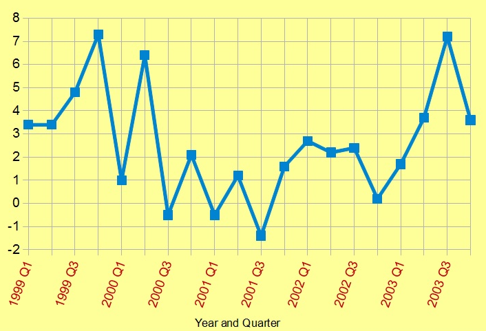
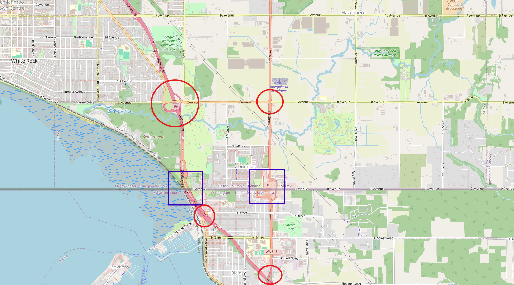

# Computer Information Systems Student

## Contact Me 
**Email:** zack@placeholder.org\
**Linkedin:** [https://www.linkedin.com/in/zack](https://www.linkedin.com/in/)  

## Education 
**Associate of Applied Science – Computer Information Systems**\
Whatcom Community College (_2024 - 2026_) (In Progress)

## Work Experience
**Resident Advisor**
Whatcom Community College
(_Jul 2024 - Present_)
- Planned and coordinated monthly events for 100+ students.
- Provided orientation, training, and ongoing guidance to new staff members.
- Developed, implemented, and utilized emergency response and incident reporting procedures to ensure student safety.
- Supported students and resolved conflicts through communication and referrals to campus and community resources.
- Upheld provisions of the student housing contract and code of conduct.
- Performed administrative duties, including handling calls, managing schedules, and coordinating with other departments.

**Youth Worker**
Boys & Girls Clubs of Whatcom County
(_Apr 2023 - Aug 2023_)
- Supervised and mentored 30+ club members (ages 6-13) to ensure safety, inclusion, and engagement during programs.
- Developed and led a diverse range of educational and athletic programs focused on building real-world skills.
- Resolved interpersonal conflicts using positive behavior strategies and emotional support.
- Planned, prepared, and served healthy meals daily.
- Handled administrative tasks, including member admissions, donation processing, and daily member check-ins/outs

## Projects

### Analysis of Assembly Line Defects in Flux Capacitor Production
[Report](.pdf)

A data-driven analysis of assembly line defects in flux capacitor production to locate root causes and provide actionable recommendations to industry leaders.

\
_Page 3 of Report_

### Investigation of Traffic Flow Patterns Around International Border Crossings
[Report](.pdf)

An analysis of traffic flow patterns around international border crossings to identify congestion points and provide traffic management recommendations.

\
_Page 15 of Report_

### Monitoring Baggage Handling Errors Across Major International Airports
[Repository](.pdf)

A website that monitors baggage handling errors at major international airports in real time and displays ongoing issues at select locations.

\
_Screenshot of Main Page_
